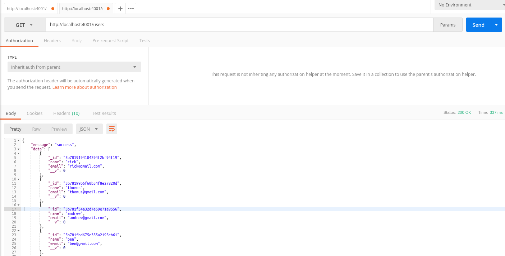
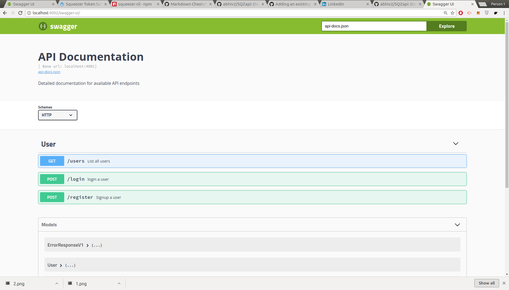

## SQZapi

This is a demo node API created using SQUEZZER serverless framework 

This Api contains module for secure login and registration of user

This Api can serve as a boilerplate for getting started  with quick api development on squeezer platform

### Modules and functionalities - 
- Squeezer serverless architecutral framework
- JsonWebToken for Auth
- Bcrypt for securing passwords
- Swagger Api documentation
- Mongodb + Mongoose for data management

#### Endpoints

- Register - to register a user
```
POST on /register
```
- Login - log in to get JWT access_token and profile info
```
POST on /login
```
- List users - get list of all users
```
GET on /users
```

#### setup 
- install and start mongodb - 27017 by default (can change uri in squeezer.yml)
- install dependecies 
```
sqz install
```
- compile the app
```
sqz compile
```
- start the app
```
sqz serve
```

Go to Url for api and test,
Also Swagger docs in available for testing/development purpose

### Demonstrations - 
- register


- login


- users list


- swagger home



